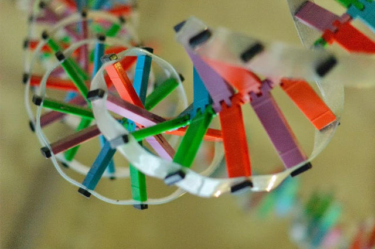

# Reto ADN CloneWars

## Objetivo

Con motivo de la celebración de la [__OSHWDem 2015__][1] el día 7 de noviembre, y a partir de una idea de que surgió en la OSHWDem del año pasado al ver esta cadena de ADN que cuelga del techo de la Domus:

Se propuso el __reto de imprimir las piezas de unión__ para algo similar con todas las piezas personalizadas con el número y nombre de la impresora __para formar lo que sería el ADN de Clone Wars__.

## Plan

Partimos del [modelo en OpenSCAD en GitHub][2] y lo ideal sería que cada impresora imprimiese el suyo, pero está claro que esto es imposible, por que muchas han pasado a mejor vida y muchos usuarios ya no andan por aquí.

Por eso, y basándonos en la base de datos de la web [maytheclonebewithyou.com][3], el libro de familia donde están, o deberían estar, la mayor parte de las impresoras de Clone Wars, [se generan los ficheros STL][STL01] para todas y no tener excusa de llevar a cabo la tarea.

Si no tienes tu impresora en [maytheclonebewithyou.com][3], ¿a qué esperas? Revisaremos cada poco esa base de datos para actualizar el listado.

Todo miembro de Clone Wars puede participar, y se reparten las piezas con la ayuda de la siguiente [__tabla para llevar seguimiento__][4]. Preferiblemente, se imprimen las piezas alternas para que no haya bloques del mismo color y ganar en vistosidad.

## Materialización

__Las piezas se enhebraron el día de la OSHWDem__ en un cable de acero y se atornillaron con dos tornillos cada una en una tira de PET que hace de la cadena. Tras el evento, quedarán en el patrimonio de Clone Wars.

![Reto materializado el día de la OSHWDEM 2015][OSH01]

## Nuevas piezas

Las nuevas piezas pueden __enviarse a Bricolabs por correo__ a: 

    Domus - Reto Clone Wars
    c/. Ángel Rebollo, 91
    15002 A Coruña

¡Que la prusa os acompañe!

## Generación virtual

  - [Vista renderizada plana de los pruseótidos][REN01]
  - [Vista renderizada en espiral de la cadena][REN02]

<!-- links -->
[1]: http://oshwdem.org
[2]: https://github.com/brico-labs/RetoADNCloneWars
[3]: http://maytheclonebewithyou.com
[4]: https://docs.google.com/spreadsheets/d/1CEc78IfhfzFyl3C44KGNHMy91A-xR38lpYUZox4AY-k/edit?usp=sharing
[OSH01]: https://raw.githubusercontent.com/brico-labs/RetoADNCloneWars/master/img/sequence-oshwdem.jpg
[REN01]: http://brico-labs.github.io/RetoADNCloneWars/image_render/ADN_odd.html
[REN02]: http://brico-labs.github.io/RetoADNCloneWars/image_render/ADN_3d_even.html
[STL01]: https://github.com/brico-labs/RetoADNCloneWars/tree/master/stl
